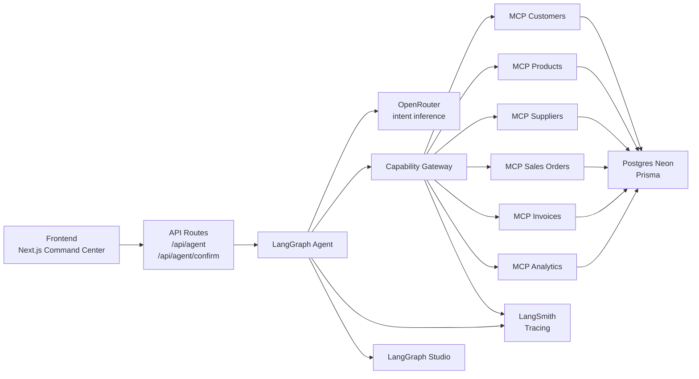

# Backend Architecture

The anti-ERP backend is organized around natural-language intent, not CRUD screens.

## Responsibilities

Frontend:
- Renders the conversational command center, confirmation UI, timeline, and MCP trace.
- Never receives LLM or database secrets.

API routes:
- Validate request payloads.
- Start the LangGraph agent or confirm a prepared order.
- Return structured responses to the frontend.

LangGraph agent:
- Parses local intent first.
- Optionally asks OpenRouter for better intent inference.
- Routes each intent to explicit graph nodes.
- Composes user-facing responses.

Capability Gateway:
- Provides a stable interface between the agent and domain MCPs.
- Routes each tool call to the correct MCP server.
- Records MCP traces and LangSmith child runs.

MCP servers:
- Own domain-specific tools for customers, products, suppliers, sales orders, invoices, and analytics.
- Execute business operations against Postgres through Prisma.

Postgres:
- Source of truth for catalog, orders, invoices, sequences, audit events, and MCP call logs.

LangSmith and LangGraph Studio:
- Show graph execution, node-level decisions, and MCP tool calls.
- Help debug both intent routing and operational failures.

## Current Graph Routes

- `sales_order`: prepares order previews and optional invoice intent.
- `analytics`: answers sales metric questions.
- `catalog`: creates customers, products, and suppliers.
- `product_update`: updates product price or stock.
- `invoice`: creates a concept invoice for the last confirmed order.
- `orders_list`: lists recent orders.
- `traditional_flow`: explains traditional ERP flow versus anti-ERP flow.
- `unknown`: returns supported capability guidance.
